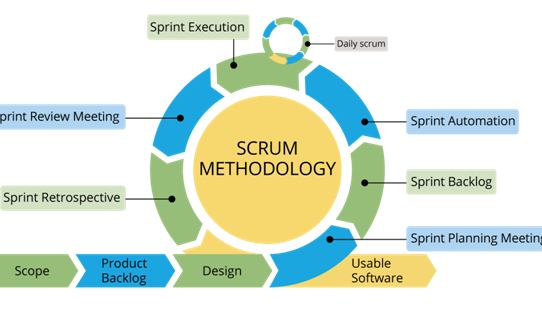
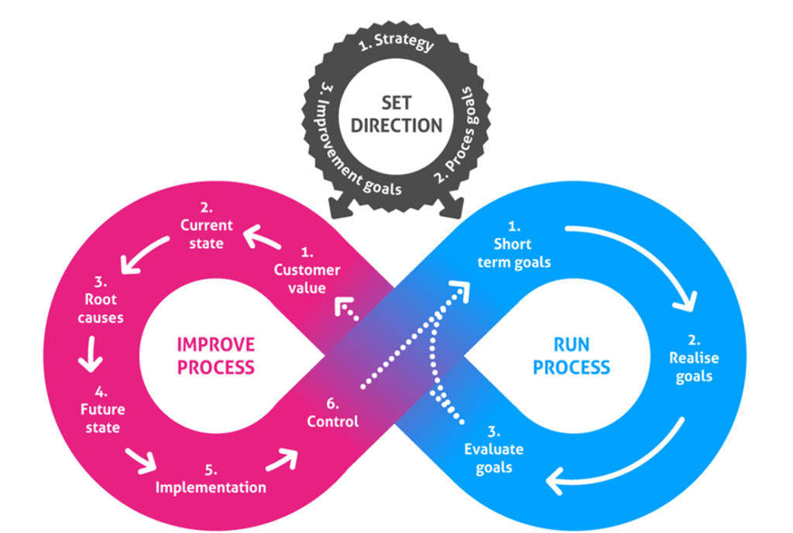
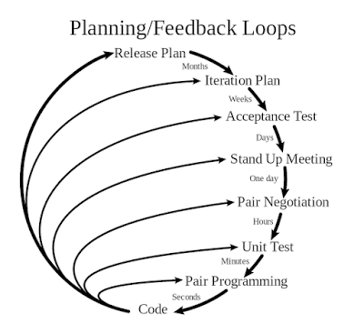
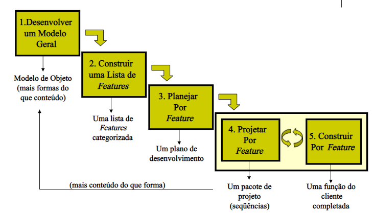
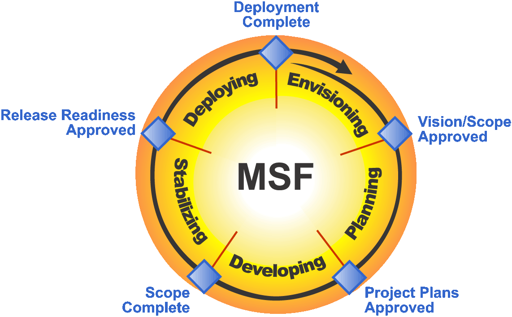
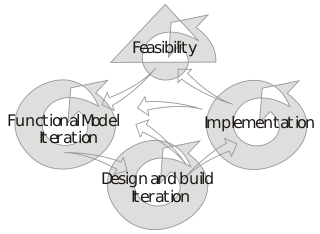
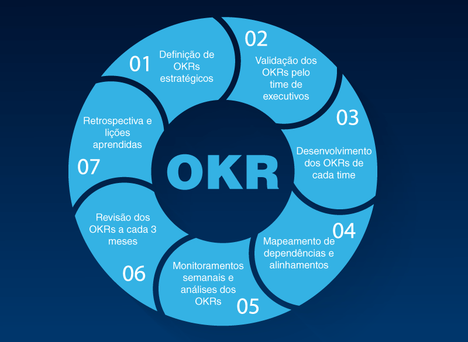

## Scrum

No gerenciamento de projetos , o scrum é uma estrutura para desenvolver, entregar e sustentar produtos em um ambiente complexo, [1] com ênfase inicial no desenvolvimento de software , embora tenha sido usado em outros campos, incluindo pesquisa, vendas, marketing e tecnologias avançadas . [2] Ele é projetado para equipes de dez ou menos membros, que dividem seu trabalho em metas que podem ser concluídas dentro de iterações time-box, chamadas sprints , não mais do que um mês e mais comumente duas semanas. A equipe scrum avalia o progresso em reuniões diárias com limite de tempo de 15 minutos ou menos, chamadas de scrums diários (uma forma de reunião stand-up) No final do sprint, a equipe realiza mais duas reuniões: a revisão do sprint, que demonstra o trabalho feito aos stakeholders para obter feedback, e a retrospectiva do sprint, que permite à equipe refletir e melhorar.

<h1 align="center">
   
</h1>

## Lean

O Lean Agile é uma junção da filosofia Lean com a metodologia Agile. A primeira nasceu nas fábricas de automóveis da Toyota, no Japão, nos anos 20. Seus fundamentos giram em torno de processos ágeis e enxutos, isto é, com eficiência de recursos — humanos, materiais, financeiros e de tempo.

<h1 align="center">
   
</h1>

## Kanban

Kanban tem a ver com visualizar seu trabalho, limitar o trabalho em andamento e maximizar a eficiência (ou fluxo). As equipes Kanban têm como foco a redução do tempo que leva para o projeto (ou história do usuário) ir do início ao fim. Para alcançar esse objetivo, elas usam o quadro Kanban e melhoram sempre o fluxo de trabalho.

<h1 align="center">
   
</h1>

## Extreme Programming (XP)

Programação extrema (do inglês eXtreme Programming), ou simplesmente XP, é considerada uma metodologia ágil e se ajusta bem a projetos de software com requisitos vagos e em constante mudança. Para isso, adota a estratégia de constante acompanhamento e realização de vários pequenos ajustes durante o desenvolvimento de software.

<h1 align="center">
   
</h1>

## Feature Driven Development (FDD)

Feature-driven development (FDD), ou Desenvolvimento Dirigido por Funcionalidades, é um método leve e iterativo para desenvolvimento de software. Criado por Jeff de Luca e Peter Coad, combina gestão de projetos com boas práticas de engenharia de software.

<h1 align="center">
   
</h1>

## Microsoft Solutions Framework (MSF)

Framework de Soluções da Microsoft (do inglês Microsoft Solutions Framework - MSF) é um guia de boas práticas de desenvolvimento de softwares, criado pela Microsoft em 1994. Originou-se da análise de times de projetos e grupos de produtos. Estas análises eram constatadas com a indústria de práticas e métodos. Estes resultados combinados eram consolidados em melhores praticas entre pessoas e processos

<h1 align="center">
   
</h1>

## Desenvolvimento de Sistemas Dinâmicos (Dynamic System Development Model)

Metodologia de Desenvolvimento de Sistemas Dinâmicos (do inglês Dynamic Systems Development Method - DSDM) é uma metodologia de desenvolvimento de software originalmente baseada em "Desenvolvimento Rápido de Aplicação" (RAD). DSDM é uma metodologia de desenvolvimento iterativo e incremental que enfatiza o envolvimento constante do usuário.

<h1 align="center">
   
</h1>

## A metodologia OKR

Podemos definir a metodologia [OKR](https://qulture.rocks/blog/okrs-o-que-sao-como-implementar/) como um modelo de gestão ágil de desempenho com foco nos resultados. Os OKRs devem ser simples o suficiente para que todos entendam e sintam-se entusiasmados a alcançá-los. Quando aplicados com êxito, os OKRs funcionam como uma ferramenta de comunicação interna, integrando as equipes por meio de objetivos alinhados à cultura organizacional da empresa.

<h1 align="center">
   
</h1>
