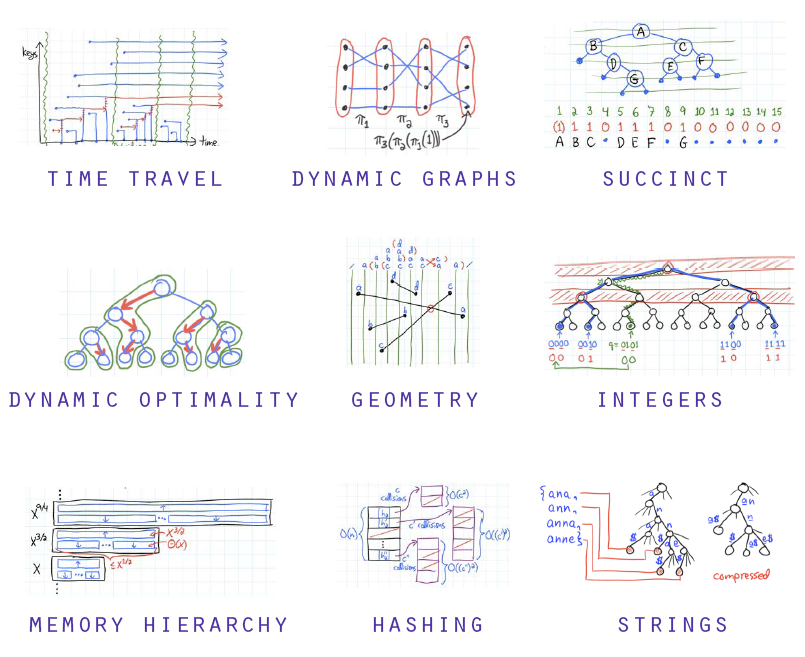

## Estrutura de dados

É uma estrutura que armazena e organiza dados, informações de modo que os dados possam ser acessados e maniúlados de forma eficiente

<h1 align="center">
   
</h1>

[Estudar](https://www.youtube.com/watch?v=N3K8PjFOhy4&list=PLGxZ4Rq3BOBrgumpzz-l8kFMw2DLERdxi&ab_channel=LoianeGroner)
