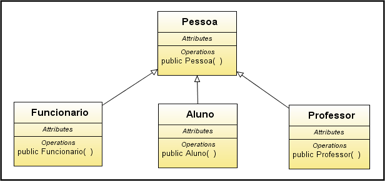

## Herança

Em Java, podemos criar classes que herdem atributos e métodos de outras classes, evitando rescrita de código. Este tipo de relacionamento é chamado de **Herança**.

Para representarmos este tipo de relacionamento na linguagem, devemos utilizar a palavra reservada **extends**, de forma a apontar para qual classe a nossa nova classe deve herdar seus atributos e métodos.

<h1 align="center">
   
</h1>

```
this = Define que o recurso pertence à classe atual.

super = Define que o recurso pertence à super classe.
```