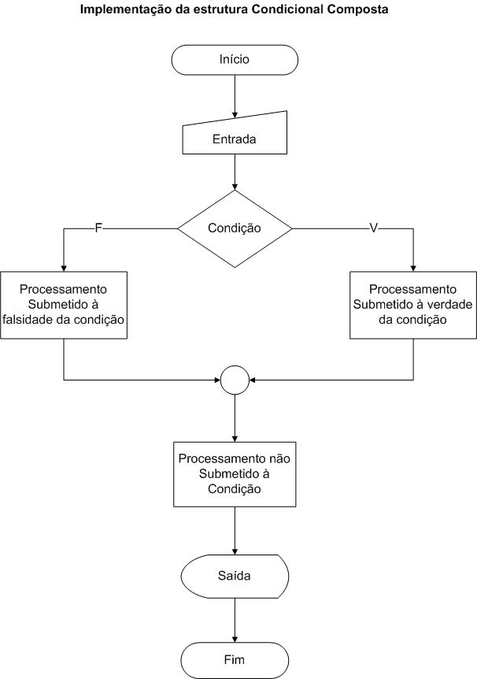
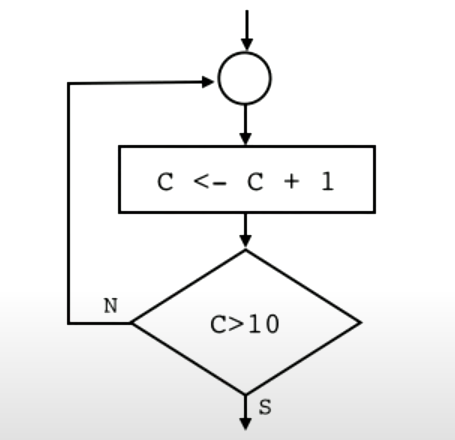
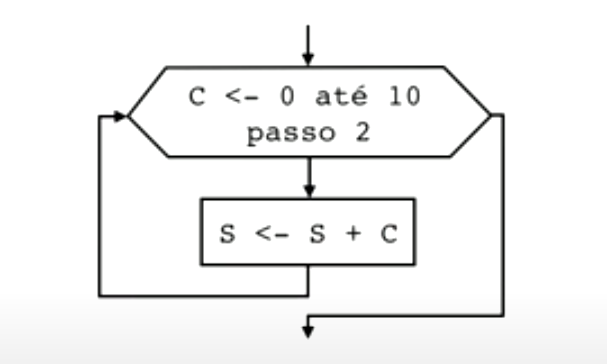

## Variável

- Variável é um local reservado na memória para armazenar um tipo de dado.
- Além de ter um **nome**, a variável também precisa ter um **tipo**.
- O tipo de dado de uma variável determina o que ela é capaz de armazenar.

O tipo de uma variável é conhecido como **tipo primitivo**.
- Consiste em 6 tipos que são: `byte`- `short`- `char`- `int`- `long`- `float`->`double`

## Atribuição

Atribuir significa armazenar um valor em uma variável.

* Em linguagem Java usamos o operador `=` para fazer uma atribuição.

Exemplo: `X = 10;`

Este comando atribui o valor `10` para a variável `X`.

* Para poder atribuir um valor a uma variável, esta tem que ter sido previamente declarada.

Abaixo estão alguns exemplos de declarações de variáveis. 

```
int idade = 3;
float sal = 1825.54f;
char = 'G';
boolena casado = false;
long id = 1L;
```
---

## Casting

Casting é a conversão de tipo, ocorre quando você atribui um valor de um tipo de dados primitivo a outro tipo.

- Em Java, existem dois tipos de fundição:

**Ampliando o Casting** (automaticamente) - convertendo um tipo menor em um tamanho de tipo maior

`byte`-> `short`-> `char`-> `int`-> `long`-> `float`->`double`

**Estreitando Casting** (manualmente) - convertendo um tipo maior para um tipo de tamanho menor

`double`-> `float`-> `long`-> `int`-> `char`-> `short->byte`


**Typecast**
```
int idade = (int) 3;
float sal = (float) 1825.54;
char letra = (char) 'G';
boolean casado = (boolean) false;
```
**Wrapper Class** (invólucro)
```
Integer idade = new Integer(3);
Float sal = new Float(1825.54);
Charactere letra = new Charactere('G');
Boolean casado = new Boolean(false);
```

---

## Tipos Primitivos

| Família| Tipo Primitivo | Classe Invólucro | Tamanho | Exemplo |
| ------ | ------ | ------ | ------ | ------ |
| Lógico | boolean | Boolean |1 bit | true |
| Líterias | char | caracter | 1 byte |  'a' |
| Líterias | - | String| 1 byte/cada |  "Java" |
| Inteiros | byte | Byte | 1 byte  |  127 |
| Inteiros | short | Short  | 2 byte | 32 767 |
| Inteiros | int | Integer| 4 byte | 2 147 483 |
| Inteiros | long| Long | 8 byte | 2^63 |
| Reais| float | Float | 4 bytes | 3.4e^+38 |
| Reais| double| Double| 8 bytes | 1.8e^+308 |

---

## Operadores Aritméticos

| Simbolo | Descrição | valor | Resultado |
| ------ | ------ | ------ | ------ |
| + | Adição | 5 + 2| 7 |
| - | Subtração | 5 - 2 | 3 |
| * | Multiplicação | 5 * 2 | 10 |
| / | Divisão |5 / 2| 1 |

---

## Operadores Unários 

| Simbolo | Descrição | valor | Resultado |
| ------ | ------ | ------ | ------ |
| ++ | Incremento | a ++ | a = a + 1 |
| -- | Decremento | a -- | a = a - 1 |

---

## Operadores de atribuição

| Simbolo | Descrição | valor | Resultado |
| ------ | ------ | ------ | ------ |
| += | Somar e atribuir | a += b | a = a + b |
| -= | Subtrair e atribuir | a -= b | a = a * b |
| *= | Mmultiplicar e atribuir | a *= b | a = a / b |
| /= | Dividir e atribuir | a %= b | a = a / b |
| %= | Resto e atribuir | a %= b | a = a % b |

---

## Classe Math

| Simbolo | Descrição | valor | Resultado |
| ------ | ------ | ------ | ------ |
| PI | Constante | Math.PI | 3.1415 |
| pow | Exponenciação | Math.pow(5,2) | 25 |
| sqrt | Raiz Quadrada | Math.sqrt(25) | 5 |
| cbrt | Raiz Cúbica | Math.cbrt(27) | 3 |
| abs | Valor Absoluto | Math.abs(-10) | 10 |
| floor | Arredonda para Baixo | Math.floor(3.9) | 3 |
| ceil | Arredonda para cima | Math.ceil(4.2) | 5 |
| round | Arredonda Aritmeticamente | Math.round(5.6) | 6 |

---

## Operador Ternário

```
Se (n1 > n2) então
  maior = n1
senão
  maior = n2
FimSe
```

```
maior = n1 > n2 ? n1 : n2;
```
---

## Operador Relacional

| Simbolo | Descrição | valor | Resultado |
| ------ | ------ | ------ | ------ |
| >  | Maior que | 5 > 2  |true |
| <  | Menor que | 4 < 1  |false |
| >= | Maior ou iqual a | 8 >= 3 | true |
| <= | Menor ou igual a  | 6 <= 6 | true |
| == | Igual a | 9 == 8 | false |
| != | Diferente de | 4 != 5 | true |

---

## Operador Lógicos

| p | q | p AND q |
| ------ | ------ | ------ |
| V | V | V |
| V | F | F |
| F | V | F |
| F | F | F |

| p | q | p OR q |
| ------ | ------ | ------ |
| V | V | V |
| V | V | V |
| F | V | V |
| F | F | F |

| p | q | p ^ q |
| ------ | ------ | ------ |
| V | V | F |
| V | V | V |
| F | V | V |
| F | F | F |

| p | !p |
| ------ | ------ |
| V | F |
| F | V |

---

## Estrutura Condicional Simples

<h1 align="center">
   
</h1>

---

## Estrutura condicional Composta

<h1 align="center">
   
</h1>

---

## Estrutura condicional de Multipla Escolha

```
import java.util.Scanner;

class Main {

  public static void main(String[] args) {

    Scanner objeto = new Scanner(System.in);

    System.out.print("Quantas pernas? ");
    int perna = objeto.nextInt();
    String tipo;
    System.out.print("Isso é um(a): ");

    switch(perna) {
      case 1:
        tipo = "Saci";
        break;
      case 2:
        tipo = "Bípede";
        break;
      case 3:
        tipo = "Tripé";
        break;
      case 4:
        tipo ="Quadrúpede";
        break;
      case 5:
        tipo = "Aranha";
        break;
      default:
        tipo = "ET";
        break;
    }
    System.out.println(tipo);
 }
}
```

---

## Estrutura de Repetição.

```
class Contador {

  public static void main(String[] args) {

    int contador = 0;

    while (contador < 10) {
      contador++;
      if (contador == 2 || contador == 3 || contador == 4) {
        continue;
      }
      if (contador == 7) {
        break;
      }
      System.out.println(contador);
    }
  }
} 
```

---

## Estrutura de Repetição com variável de controle


<h1 align="center">
   
</h1>


---

## Exercícios

## Exercícios de Java #01

Assinale a alternativa que contém a descição correta de algoritmo

- A) Algoritmo é uma coleção de livros que de uma mesma matéria, normalmente relacionada à Engenharia de Software.
- B) Algoritmo é uma operação matemática usada, por exemplo, para calcular a intensidade sonora media em decibéis.
- C)✔️ Algoritmo é uma descrição das etapas de resolução de um problema ou a indicação ordenada de uma seguência de ações bem-definidas.
- D) Algoritmo é uma definição formal de hierarquia de funcionários de uma empresa de desenvolvimento de software de grande porte.

---

Assinale a opção que NÃO apresenta um exemplo de Linguagem

- A) Delphi (IDE) - Object Pascal
- B) de Máquina.
- C) Assembly
- D)✔️ Windows XP
- E) Visual Basic

---

Qual é o utilitário responsável por gerar, a prtir de um programa em uma linguagem de **alto nível**, um programa escrito em uma **linguagem de máquina** não executável
chamado de módulo-objeto?

- A) Interpretador
- B) Depurador
- C) Loader
- D) Linker
- E)✔️ Compilador

Obs:
Compilador: código fonte -> código Objeto
Linker: código objeto -> executável
Interpretador: código objeto -> executável

---

A expressão Z = X % Y corresponde a Z igual

- A) a X % do valor de Y.
- B) ao resto da divisão de Y por X.
- C)✔️ ao resto da divisão de X por Y.
- D) ao quociente da divisão de X por Y
- E) ao quociente da divisão de Y por X.

---

Fluxograma é um tipo de:

- A)✔️ Representação gráfica de algoritmos.
- B) Informação sobre tipos de dados
- C) Livro de análise de sistemas.
- D) análise de sistemas
---

## Exercícios de Java #02

Em relação à lingágem de programação Java, complete corretamente as lacunas das sentenças abaixo, assinale a opção correta.

I - O comando ____ do J2SW Development Kit executa um aplicativo Java

II - O comando ____ do J2SE Development Kit compila um programa Java.

III - Um programa Java deve terminar com a extensão de arquivo ____.

IV - Quando um programa Java é compulado, arquivo produzido pelo compulador termina com a extensão de arquivo ____. 

V - O arquivo produzido pelo compilador Java contém ____ que são executados pela Java Virtual Machine.

- A)✔️ java / javac / java / class / bytecondes
- B) javac / java / class / java / bytecodes
- C) main / javac / java/ jar / class
- D) java / class / rar / jar / javac
- E) rar / jar / javac / class

---

Coloque Falsas (F) ou Verdadeiras (V) e em seguida assinale opção que contém a seguência correta.

```
( ) A área de memória requerida para operar com o programa compilado é menor que a requierida para a interpretação.
```

```
( ) Um programa interpretado requer uma a´rea de memória menor do que a do programa compilado.
```

```
( ) O Tempo para execuçpão interpretada é maior do que o tempo para execução compilada.
```

```
( ) Um programa compilado requer um tempo de execução maior do que um programa interpretado.
```

| Compilado | Interpretado |
| ------ | ------ |
|+ Memória | - Memória |
|- Tempo | + Tempo |

- A✔️) F - V - V - F
- B) V - F -F - V
- C) F - V -V - V
- D) V - F - V - V

---

Na construção de algoritmo, como seria  representado o cálculo da multiplicação da base pela altura e em seguida a divisão pela constante 2?

- A) área = base * altura 2
- B)✔️ área <- (base * altura)) / 2
- C) área <- base * altura) /2
- D) área = base * altura / 2 

---

Assinale a alternativa que corresponde à fórmula correta para calcular a média aritmética entre 4 notas, representada pelas
variáveis média aritmética entre 4 notas representadas pelas variáveis N1, N2, N3, N4.

- A) N1 + N2 + N3 + N4 / 4
- B) N1 + N2 + N3 + (N4 / 4)
- C) N.(1+2+3+4) / 4
- D)✔️ (N1 + N2 + N3 + N4) / 4

---

Informe se é falso (F) ou verdadeiro (V) o que se afirma sobre o diagrama de blocos abaixo. A seguir, indique a opção com a seqüência correta.

<h1 align="center">
   
</h1>


Considere:

**C1** e **C2** são condições.

**I1**, **I2**, **I3** e **I4** são instruções.

```
( ) I1 executa se C1 for falsa.
```

```
( ) I2 somente executa se C2 for verdadeira.
```

```
( ) Se C1 e C2 forem falsas a I3 executa.
```

```
( ) I4 sempre executa, independente de C1 e C2.
```

- A) V – F – V – V
- B) F – F – F – V
- C)✔️ V – F – V – F
- D) F – V – V – F

---

## Exercícios de Java #03

Assinale a alternativa que contém uma expressão lógica com resultado VERDADE Considere X = 7 e Y = 4.

- A)✔️ (X > 5).E.(.NÃO.(Y < 3))
- B)(X = 5 ).OU.(Y > 8)
- C)(Y > 10).E.(X = 7)
- D) .Não.(X =7)

---

Assinale a alternativa que contenha o valor final d a variável X após a execuçao do trecho de programa em Português estruturado abaixo.
Considere os valores iniciais A =6, B = 2, C = 4, D = 3.

```
se.não.(A > 6).Ee.não.(b <3)então 
x <- A/D
senão
X <- C * A
fim_se
```

- A)2
- B)12
- C)✔️ 24
- D)48

---

| Condição 1| Condição 2 | Resultado |
| ------ | ------ | ------ |
| falsa | falsa | falsa |
| verdadeiro | false | verdadeiro |
| falsa | verdadeiro | verdadeiro |
| verdadeiro | verdadeiro | verdadeiro |

- A).e.
- B)✔️ .ou.
- C).if.
- D).nao.
---

Uma pilha é uma versão limitada de uma list encadeada. Novos
só podem ser adicionados e retirados de uma pilha pelo topo. Em Java, a classe
**Stack** possui métodos de manipulaçao em pilhas. Em pacotes a classe Stack está definida.

- A)✔️ java.util
- B) java.lang
- C) java.net
- D) java.io
- E) java.swt

---

Na linguagem de programação Java, que palavra-chave cria um **objeto** de um classe especifica?

- A) MAIN
- B) PUBLIC
- C) CLASS
- D) PRIVATE
- E)✔️ NEW

---

Em relação ao tipos básicos de dados (tipos primitivos),
assinale a opção INCORRETA.

- A) booleano (ou lógico): conjunto de valores false ou verdadeiro.
- B)✔️ vetor: estrutura que suporta NxM posições de um mesmo tipo
- C) caracter: qualquer conjunto de caracteres alfanuméricos.
- D) inteiro: qualquer número inteiro, negativo, nulo ou positivo.
- E) real: qualquer número real, negativo, nulo ou positivo.

---

Marque 1 para dados do tipo inteiro e 2 para dados de outeos tipos

```
( ) "582.4"
```

```
( ) .verdadeiro.
```

```
( ) 105
```

```
( ) -102
```

```
() "0"
```

```
() "informação"
```

```
() 0.82
```

- A) 2, 2, 1, 1, 1, 2, 1
- B)✔️ 2, 2, 1 ,1, 2, 2, 2
- C) 1, 1, 1, 2, 2, 1, 2
- D) 1, 2, 2, 2, 1, 1, 1

---

Assinale a alternativa que contenha somente nomes válidos de variáveis

- A) índice, #pagina, contexto
- B)✔️ nome1, sobrenome2, senha3
- C) 2-nome, sobrenome, endereco
- D) 1-nome, 2-sobrenome, 3-senha

---

Assinale a alternativa que completa corretamente a lacuna da afirmativa a seguir.

São caracterizados como tipos_____os dados numériocos positivos ou negativos, excluindo-se destes qualquer fracionário.

- A) caracteres
- B) lógicos
- C)✔️ inteiros
- D) reais

--

Considerando os tipo de dados, relacione as colunas e , a seguir, assinale a alternativa com a sequência correta.

(1) Inteiro

(2) Reais

(3) Caracteres

(4) Lógicos

```
( ) 35; 0; -56
```

```
( ).F; .V
```

```
( )"Rua Brigadeiro Layra"
```

```
( ) -0,5; 1,8; -4
```

- A) 3, 1, 4, 2
- B) 2, 4 ,3, 1
- C) 1, 2, 3, 4
- D)✔️ 1, 4, 3, 2

---

## Exercícios de Java #04

Indique a opção que contem o valor final da variável X, após a execução do trecho de programa em Português
Estruturado mostrado ao lado. Considere os seguintes valores para as variáveis : A = 3;  B = 2; C = 8; D = 7.
```
se .não.( A > 3 ) .e. .não. (B  <  5) então
X  <- 10
senão
  se (A  >=  2 ) .ou (C  <+ 1) então
    x  <- (A + D) / 2
  senão
    se (A =  2) .ou. (B  <  7) então
      X  <- (A + 2) * (B  - 2)
    senão
      X <- ((A + C) / B * (C + D))
    fim_se
  fim_se
fim_se
```

- A) 10
- B)✔️ 5
- C) zero
- D) 82,5

---

Indique a alternativa que tem a representação na forma da expressão aritmética abaixo:
Z = 5 ^2  / (32 -13) +8.2

- A) Z = 5 * 5 / (32 - 13) + 8 x 2
- B) Z = <-(5 * 5 / (32 -13) + (8 * 2))
- C) Z =  5 ^2 / (32 - 13) + 8 x 2
- D)✔️ Z <- (5 ^2 ) / (32 - 13) + (8 * 2))

---

## Exercícios de Java #05

Seguindo a linguagem de programação Java, assinale a opção INCORRET.

- (A) O java diferencia letras maiúsculas de minúsculas.
- (B)✔️ A palavra-chave  **new** introduz uma declaração de classe e é  imediatamente  seguida pelo nome da classe
- (C) O método **main** é  o ponto de partida de cada aplicativo java e deve iniciar com **public static void main (String args[])**
- (D) O corpo de cada declaração de classe e delimitado por chaves
- (E) Cada  Instrução termina com um ponto e vírgula 

---

Uma pilha é  uma versão  limitada de uma lista encadeada. Novos nós  só  podem ser adicionados e retirados de uma pilha pelo topo.
Em java, a classe **Stack** possuí  métodos  de manipulação  em pilhas. Em qual pacote a classe **Stack** está  definidas?

- (A)✔️ java.util
- (B) java.lang
- (C) java.net
- (D) java.io
- (E) java.swt

---

Na linguagem de programação  java, que palavra-chave cria um objeto de uma classe específica?

- (A) MAIN
- (B) PUBLIC
- (C) CLASS
- (D) PRIVATE
- (E)✔️ NEW

---

## Exercícios de Java #06

Em relação  aos tipos básicos de dados (**tipos primitivos**), assinale a opção INCORRETA

- (A) booleano (ou lógico): conjunto de valores falso ou verdadeiro.
- (B)✔️ vetor: estrutura que suporta **NxM** posições  de um mesmo tipo
- (C) caractere: qualquer conjunto de caracteres alfanuméricos. 
- (D) inteiro: qualquer número inteiro, negativo, nulo ou positivo.
- (E) real: qualquer número, negativo, nulo ou positivo.

---

Marque 1 para dados do tipo inteiro e 2 para dados de outros tipos

( ) "582.4"

( ) .verdadeiro.

( ) 105

( ) -102

( ) "0"

( ) "informação"

( ) 0.82

- (A) 2, 2, 1, 1, 1, 2, 1
- (B)✔️ 2, 2, 1, 1, 2, 2, 2
- (C) 1, 1, 1, 2, 2, 1, 2
- (D) 1, 2, 2, 2, 1, 1, 1

---

Assinale a alternativa que contenha somente nomes válidos  de variáveis

- (A) índice, #página, contexto 
- (B)✔️ nome1, sobrenome2, senha3
- (C) 2-nome, sobrenome, endereço 
- (D) 1-nome, 2-sobrenome, 3-senha

---

Assinale a alternativa que completa corretamente a lacuna da afirmativa a seguir.
São caracterizados como tipos ____ os dados numéricos positivos ou negativos, excluindo-se estes qualquer fracionário

- (A) caracteres
- (B) lógicos
- (C)✔️ inteiros
- (D) reis

---

Considerando os tipos de dados, relacione as colunas e a seguir, assinale a alternativa com a sequencia correta

(1) Inteiros

(2) Reais

(3) Caracteres

(4) Lógicos 

( ) 35; 0 ; -56

( ) .F.; .V.

( ) "Rua brigadeiro Lyra"

( ) - 0,5; 1,8; -4

- (A) 3, 1,  4,  2
- (B) 2, 4, 3, 1
- (C) 1, 2, 3, 4
- (D)✔️ 1, 4, 3, 2

---


## Exercícios de Java #07

Considerando o trecho de código a seguir, contruíndo em linguagem Java, marque a opção que preencha as lacunas:

```
int n = 4;
System.out.println("O valor da variável é " + n ++);
```

Executando as linhas acima, será exibida a mensagem "O valro da variável é____" e o valor final de n após a execução será___.

- A) 3 e 4
- B)✔️ 4 e 5 
- C) 5 e 5
- D) 3 e 3

---

Considerando o tratamento de tipos primitivos pelo Java, analise o código a seguir e indique que o valor será impresso na tela

```
int n1 = 2, n2 = 5;
double resultado = n2 / n1;
System.out.print(resultado);
```

- A) 5.0
- B)✔️ 2.0
- C) 2.5
- D) 3.0

---

Execute as três instruções Java a seguir e marque  opção que contém o val0r que será impresso na tela:

```
int v1 = 7, v2 = v1 % 2, v3 = 2;
v3 += v2;
System.out.printlnU(v1 + "" + v2 + "" + v3);
```

- A) 7 2 4
- B) 7 1 1 
- C)✔️ 7 1 3
- D) 7 0 2

```
V1 = 7
V2 = V1(7) / 2 = 1
V3 = 2
V3 = 2 + V2(1) = 3
System.out.printlnU(v1 + "" + v2 + "" + v3);
7 1 3
```
---

## Exercícios de Java #08

Dados as linhas a seguir:

```
int x = 8, y = 3;
int w = x / y;
Sting z = (w % 2 == 0) ? "frase1":"frase2";
System.out.println(z);
```
P que acontecerá se esse código for executado?

- a) Um erro de tipo na variável w
- b) Um erro de atribuição na vaiável z
- c)✔️ Será impresso "frase1"
- d) Será impresso "frase2"

---

Analise o código a seguir e infique o que será impresso na tela:

```
String parte1 = "Curso";
String parte2 = "Video";
String parte3 = parte1 + parte2;
String parte4 = "CursoVideo";
System.out.println(parte3 == parte4);
System.out.println(parte3.equals(parte4));
```
- a) CursoVideo
- b)✔️ false true
- c) tru true
- d) true false

- Obs: `==` compara se dois objestos sao iguais
- `.equals` compara se o conteudo de dois objetos sao iguais

---

Analise o código a seguir e indique o que será impresso na tela:

```
boolean val1 = (4>=5), val2 = (4<4), val13 = (val1==val2);
boolean val4 = val1 ^ va13;
boolean val5 = !val2 && val4;
System.out.println(val4 + "" + val15);
```
- a)✔️ true true
- b) false true
- c) false false
- d) true false

---

## Exercícios de Java #09

Analise o algoritmo abaixo

```
Linha 1    início 
	Linha 2    inteiro Y, X, DIV;
	Linha 3    leia(Y);
	Linha 4    X = Y % 7;
	Linha 5    se X > 10
		Linha 6    então  DIV = verdadeiro;
		Linha 7    senão  DIV = 10;
	Linha 8    fim se;
Linha 9    fim
```

Assinale a opção  que apresenta a linha que contém o erro na execução  do algoritmo.

- (A) linha 2     inteiro Y, X, DIV.
- (B) linha 4    X =  Y % 7.
- (C) linha 5    se X > 10.
- (D)✔️ linha 6    então  DIV = verdadeiro 
- (E) linha 7    senão  DIV = 10

---

Indique o resultado de "x" do trecho do programa em português  estruturado, mostrado abaixo. Para as saídas considere os seguintes valores:,
A=2; B=3; C=3; D=4

```
se .nao. (D<5) então
x <- (A+B) * D
senão
x <- (C+A) * B
fim_se
Escreva x,
```

- (A)✔️ 15
- (B) 10
- (C) 25
- (D) 20

---

Dada a estrutura representada abaixo

```
int a = 5 , b = 2;
String c;

if (a > b) {
    c = "Primeiro é Maior";
} else {
    c = "Segundo é Maior";
}
```

Que linha substituiria a condição apresentada?

-  (A) c = (a  <  b)? "Segundo é Maior" : "Primeiro é Maior";
- (B)✔️ c = (a <= b)? "Segundo é Maior" : "Primeiro é Maior";
- (C) c = (a > b)? "Segundo é Maior": "Primeiro é Maior";
- (D) c = (a >= b)? "Primeiro é Maior": "Segundo é Maior";

---

## Exercícios de Java #10

3. Observe o trecho de programa.

```
public class Exemplo {

  public static void main (String args[]) {
	
  System.out.print("Marinha do Brasil");
  }
}
```

Com base na classe Java acima, assinale a opção correta.

- A) o método main necessita receber o array como parâmetro para ser executado.
- B) Os modificadores public e class são desnecessários para executar o código.
- C) sua execução dependerá da versão da JVM em uso.
- D) Essa classe não será execurada pela JVM.
- E)✔️ O método main é o primeiro a ser chamado e executado pela JVM.


Observe o código Java 	abaixo:

```
class Teste {
  public static void main(String[] args) {
    
    String nome = "João";
    imprimeNome("Empty");
  }

  public static void imprimeNome(String nome) {
    if (!nome.isEmpty()) {
      System.out.println("Tudo bem" + nome + "?");
    } else {
      System.out.println("O nome é " + nome + "?");
    } 
  }
}
```

Qual será a saída do programa acima?

- (A) Tudo bem Empty?
- (B) Tudo bem Joao?
- (C)✔️ O nome é Empty?
- (D) O nome é João? O nome é João?

---

O que será impresso quando o seguinte programa escrito na linguagem Java for compilado e executado?

```
class Teste {
  public static void main(String args[]) {
	
  char ch;
	
  Sting test2 = "abcd3";
  String test = new String("abcd");
	
  if (test.equals(test)) {
    ch = (test == test2) ? test.charAt(0) : test.charAt(1);
  } else {
     ch = (test == test2) ? test.charAt(2) :test.charAt(3);
  }
  System.out.println(ch);
  }
}
```

- (A) a
- (B)✔️ b
- (C) c
- (D) d

---

## Exercícios de Java #11

Analise as seguintes variáveis em Java a seguir.

```
char c = 'c';
int i = 10;
double d = 10;
long l = 1;
String s = "Hello"
```

De acordo com as variáveis acima, qual das instruções  abaixo compila sem erro?

- (A)✔️ c = c + 1;
- (B) s += i;
- (C) i += s;
- (D) c += s;
- (E)✔️ i += l;

---

Qual das afirmações  a seguir é  VERDADEIRA?

- (A) O comando break dentro de um loop while faz com que o controle seja passado para a  próxima interação do loop.
- (B) O comando continue dentro de um loop while faz com que o controle seja passado para o próximo  bloco de código  após o loops.
- (C) O comando return não pode ser utilizado dentro de loops.
- (D) Todas as alternativas acima são  verdadeiras.
- (E)✔️ Todas as alternativas acima são falsas.

---

Análise  o código  em Java a seguir 

```
public class Prova {

    public static void main(String[] args) {
        int i = 1;
        int a = 0;
        while (i < 10) {
            ++a;
            i = i + 1;
            if (a > 6) ++i;
        }
        System.out.println(i);
        System.out.println(a);
    }
}
```

Sabendo-se que o código  acima foi escrito e executado utilizado o IDE NetBeans 6.0.1, assinale opção  correta referente aos valores impressos de `i` e de `a` respectivamente.

- (A)✔️ 11 e 8
- (B) 11 e 7
- (C) 10 e 6
- (D) 10 e  7
- (E) 11 e 7

---

## Exercícios de Java #12


Considerando o trecho de Fluxograma representado e mantendo a mesma estrutura de lógica  de programação qual seria a sua transcrição válida para Linguagem Java,

<h1 align="center">
   
</h1>

```
(A)✔️ do {
        c++;
} while (c <= 10);
```

```
(B) do { 
        c++; 
} while (c >10);
```

```
(C)  while (c <= 10) {
        c++; 
}
```

```
(D)  while (c >10) { 
        c++; 
}
```

---

Qual será  o resultado impresso pelo trecho de código  escrito em Linguagem  Java?

```
public class Teste { 

    public static void main(String[] args) {
        int c = 1;

        do {
            if (c % 5 != 0) System.out.println(c);
            else break;
            c += 1;
        } while (c <= 10);
    }
}
```

- (A) 1 2 3 4 5 6 7 8 9 10
- (B) 1 2 3 4 5 6 7 8 9
- (C)✔️ 1 2 3 4
- (D) Ocorrerá  um erro de sintaxe

---

## Exercícios de Java #13

Considerando  o trecho de Fluxograma  representado e mantendo a mesma estrutura de lógica  de programação, qual seria a sua transcrição  válida  para Linguagem  Java?

<h1 align="center">
   
</h1>


```
A))✔️
     for (int c = 0; c <= 10; c += 2) { 
            s += c;
        }
```

```
B)
        for (int c = 0; c < 10; c += 2) {
            s += c;
        }
```

```
C)
        for (int c = 0; c <= 10; c++) {
            s += c;
        }
```

```
D)
        for (int c = 0; c >= 10; c++) {
            s += c;
        }
```

---

Qual dos códigos  abaixo vai efetuar uma iteração  com exatamente 10 laços  utilizando uma estrutura de repetição  com variável  de controle ?

```
A) for (int c = 1; c < 10; c++)
```

```
B)✔️ for (int c = 33; c > 13; c -= 2)
```

```
C) for (int c = 1; c <= 10; c--)
```

```
D) for (int c = 13; c <= 33; c += 2)
```

---

Qual será  o resultado impresso pelo trecho de código escrito em Linguagem de Java?

```
        for (int i = 0; i < 15; i += 2 ) {
            if (i % 3 == 0) continue;
            System.out.println(i);
        }
```

- A) 0 1 2 3 4 5 6 7 8 9 10 11 12 13 14 15
- B) 0 2 4 6 8 10 12 14
- C) 0 2 4 8 10 14
- D)✔️ 2 4 8 10 14
