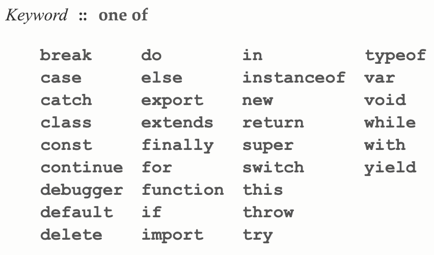

## Introdução a JavaScript

- JavaScript é uma linguagem de programação de auto nível, dinâmica, **interpretada** e não tipada, conveniente para estilos de programação orientados a objetos e funcionais. A sintaxe de JavaScript é derivada da linguagem Java, das funções de primeira classe de **Schema** e da herança baseada em protótipagem de **Self**.

- JavaScript foi criada pela [`Netscape`](https://pt.wikipedia.org/wiki/Netscape) na fase inicial da Web, JavaScript é marca registrada e licenciada pela [`Sun Microsystems`](https://pt.wikipedia.org/wiki/Sun_Microsystems) agora pertence a [`Oracle`](https://pt.wikipedia.org/wiki/Oracle_Corporation), usada para descrever a implementação da linguagem pelo `Netscape` que agora é Mozilla Foundation[(`moz://a`)](https://pt.wikipedia.org/wiki/Mozilla_Foundation).
A Netscape enviou a Linguagem para a [`ECMA`](https://pt.wikipedia.org/wiki/Ecma_International)(acrônimo para **E**uropean **C**omputer **M**anufacturers **A**ssociation) devido a padronização e questões relacionadas a registro da marca.
A versão padronizda manteve o nome de [`ECMAScript`](https://pt.wikipedia.org/wiki/ECMAScript), atualmente está na versão 10 conhecida como `ES10`

## Estrutura léxica

- A estrutura léxica de uma linguagem de programação é o **conjunto de regras elementares** que especificam o modo de escrever programas nesta linguaguem.

##### Conjunto de caracteres

-  Os programas JavaScript são escritos com conuntos de catactes [`Unicode`](https://pt.wikipedia.org/wiki/Unicode). Unicode é um superconjunto de [`ASCII`](https://pt.wikipedia.org/wiki/ASCII)( **A**merican **S**tandard **C**ode for **I**nformation **I**nterchange) e [`Latin-1`](https://pt.wikipedia.org/wiki/ISO/IEC_8859-1)(ISO/IEC 8859-1)

##### Diferenciação de maiúscula e minúscula

- JavaScript é [**case-sensitive**](https://pt.wikipedia.org/wiki/Case-sensitive) é uma linguagem que diferencia maiúscula de minúscula. Iso significa que palavras-chaves, variáveis, nome de funções e outros identificadores da linguagem devem ser digitados com a composição compatível da letra.
Por exemplo a palavra chave `while` não é igual a `While` e `WHILE`.
Entretando, HTML **não diferencia letra maiúscula de minúscula**, isso pode confundir muitos programadores iniciantes porque JavaScript é muito utilizado no lado do cliente (Front-End)

##### Epaço em branco, quebra de linhas e caracteres de controle de formato, pontos e vírgulas

- JavaScript ignora espaços que aparecem entre sinais e também ignora quebras de linhas(mas a exceções)
Assim como muitas linguagens de programação.JavaScript usa o ponto e vírgula (`;`) para **separar instruções**.
Isso é importante para tornar claro o significado de seu código sem um **separador**, o fim de uma instrução pode parecer o início da segunda ou vice-versa. Normalmente em JavaScript você pode omitir o ponto e virgula entre duas **instruções** caso essas sejam escritas em linhas separadas, ou se o próximo sinal seja uma chave de fechamento (`{}`).
Exemplo válido:

```js
a = 3;
b = 4;
```

Exemplo válido:

```js
a = 3
b = 4;
```
Exemplo invalido:
```js
a = 3;
b = 4
```

Exemplo válido:

```js
a = 3; b = 4 ;
```
Exemplo invalido:

```js
a = 3 b = 4 ;
```

##### Palavras Reservadas

- JavaScrip reserva vários identificadores como palavras-chaves da própria linguagem. Você não pode usar essas palavras como identificadores em seu programas, você pode ver a lista completa [`aqui`](https://developer.mozilla.org/pt-BR/docs/Web/JavaScript/Reference/Lexical_grammar#palavras-chave_reservadas_do_ecmascript_2021)

<h1 align="center">

</h1>

##### Comentários

- JavaScript aceita dois estilos de comentários. Qualquer texto entre `//` e o final de uma linha é tratado como comentário e é ignorado pelo JavaSript. E qualquer bloco de texto escrito com `/*` e `*/` são tratados como comentarios.

Exemplo:
 
```js
// Esse é um comentário de uma linh.

/*
Esse é um comentário em bloco.
Esse é um comentário em bloco.
Esse é um comentário em bloco.
*/
```

##### Literais

- Um _literal_ é **um valor de dados que aparece diretamente em um programa**. Os valores seguintes são todos literais.

Exemplo:

| Literal | Descrição |
| ------ | ------ |
| `12` | Um inteiro |
| `1.2` | Um ponto flutuante |
| `"Hello"` | Uma string de texto |
| `"Hi"` | Outra string |
| `true` | Um valor booleano |
| `false` | Outro valor booleano |
| `/javascript/gi` | Uma "expressão regular" literal (para comparação de padrões) |
| `null` | Ausência de um objeto |

## Identificadores

Um **identificador** é simplesmente um nome. Em JavaScript, os identificadores são usados para dar
nomes a variáveis e funções e para fornecer rótulos para certos laços no código JavaScript. Um identificador
JavaScript deve começar com uma letra, um sublinhado (`_`) ou um cifrão (`$`). Os caracteres
subsequentes podem ser letras, dígitos, sublinhados ou cifrões. (Os dígitos não são permitidos como
primeiro caractere, para que JavaScript possa distinguir identificadores de números facilmente.) Todos
estes são identificadores válidos:

```
i
my_variable_name
v13
_dummy
$str
```
